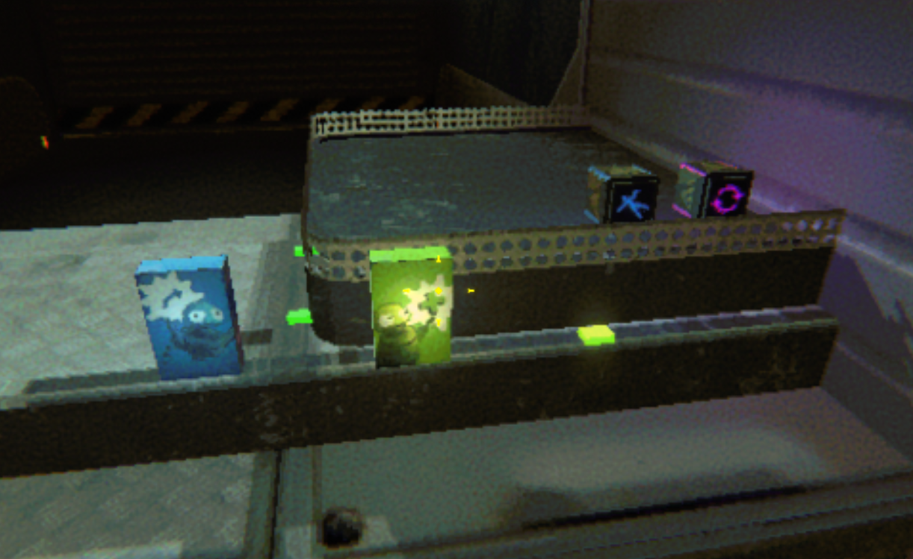
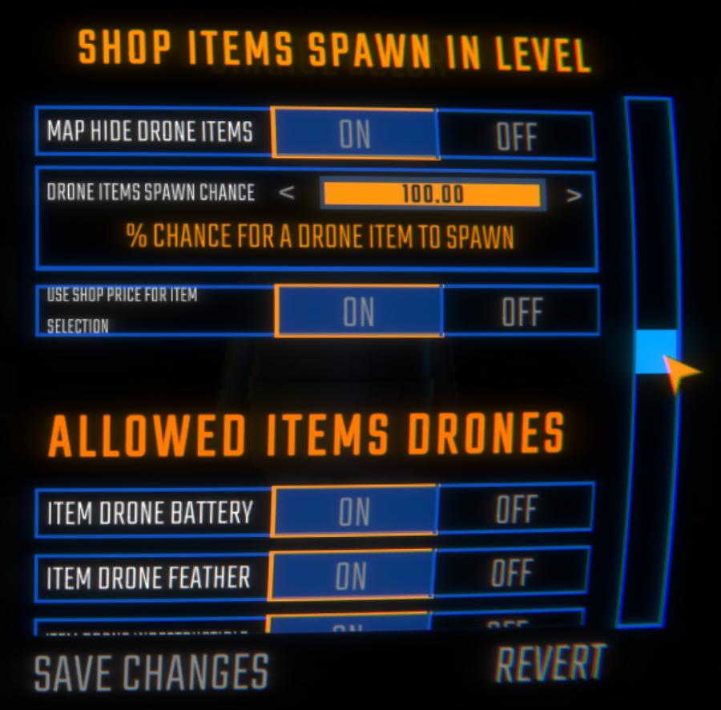

# 🛒 REPO Shop Items Spawn in Level

## ✨ Overview

This mod enhances gameplay by allowing upgrade items and drones (normally only available in shops) to spawn throughout levels as findable loot. Hunt for valuable upgrade items as you explore!

## 🕹️ Multiplayer Friendly

This mod is designed to work seamlessly in multiplayer. Only the host needs to have the mod installed for all players to benefit from the new Features that it brings. This means you can enjoy the excitement of hunting for rare upgrade items together with your friends, without requiring everyone to install the mod.

## 📦 Extraction Point Integration

Found a valuable upgrade or drone during your run? Bring it to any extraction point, and it will be sucked up and automatically added to your bought Items! The item will be waiting for you in the Lobby Level to use in your next run.

## ⚙️ Configuration

Configure the mod through the BepInEx config file.
It is recommended to use the [REPOConfig](https://thunderstore.io/c/repo/p/nickklmao/REPOConfig) UI for easier configuration in-game.

### Upgrade Items

| Setting | Description | Default |
|---------|-------------|---------|
| `SpawnUpgradeItems` | Enable/disable upgrade items spawning in levels | `true` |
| `MapHideShopUpgradeItems` | Whether upgrade items are hidden on the map (Client Only) | `true` |
| `UpgradeItemSpawnChance` | Percentage chance (0-100) for upgrade items to spawn on a valid spawn point | `2.5%` |
| `UseShopPriceForItemSelection` | If ON: Cheaper upgrade items appear more often. If OFF: All upgrade items have equal chance | `true` |

### Drone Items

| Setting | Description | Default |
|---------|-------------|---------|
| `SpawnDroneItems` | Enable/disable drone items spawning in levels | `true` |
| `MapHideDroneItems` | Whether drone items are hidden on the map (Client Only) | `true` |
| `DroneItemsSpawnChance` | Percentage chance (0-100) for drone items to spawn on a valid spawn point | `0.95%` |
| `UseShopPriceForItemSelection` | If ON: Cheaper drone items appear more often. If OFF: All drone items have equal chance | `true` |

### Item Allow List

The mod supports controlling which specific upgrade items can spawn in levels. In the config file, you'll find two sections:
- `[AllowedItems Upgrades]` - Controls which upgrade items can spawn
- `[AllowedItems Drones]` - Controls which drone items can spawn

Each item has its own toggle to enable or disable spawning. These lists include all available items (including modded items) that could possibly spawn.

Please note that you have to start the game with the mod installed at least once to generate the configuration options.

## 🔮 Planned Features

- Support for additional item types
- Custom item distributions based on level difficulty
- Killed enemies may drop upgrades or healing items

## ⚠️ Known Issues

- Currently only supports item upgrades and drones (more item types coming in future updates)
- Please report any issues [here](https://github.com/Gamatek/REPOShopItemsSpawnInLevelPlus/issues)

## ❓ Troubleshooting

### [No config file](https://github.com/JohnDeved/REPO_Shop_Items_in_Level/issues/7)

If you do not see the configuration file, follow these steps:

1. Start the game with the mod installed at least once to generate the configuration file.
2. Check the `\BepInEx\config` directory for the file named `REPOShopItemsSpawnInLevelPlus.cfg`.
3. Ensure you are using mod version 1.1.2 or higher, as the configuration file is only generated for these versions.
4. If the configuration file is still not generated, verify the mod version and update if necessary.

## 📝 Version History

### v1.0.0 (2025/11/02)

- Initial release.

## 👤 Credits

Created by Gamatek.
Original by JohnDeved.

## 🔗 Links

- [GitHub Repository](https://github.com/Gamatek/REPOShopItemsSpawnInLevelPlus)
- [Thunderstore](https://thunderstore.io/c/repo/p/Gamatek/REPOShopItemsSpawnInLevelPlus/)
- [Bug Reports](https://github.com/Gamatek/REPOShopItemsSpawnInLevelPlus/issues)